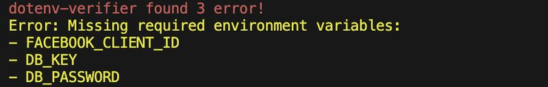
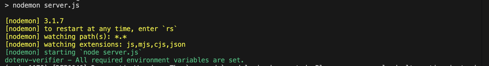

# dotenv-verifier

 A simple Node.js package to validate required environment variables in your project.

Error


Success



```
const checkEnvVariables = require('dotenv-verifier');


//List of required environment variables
const requiredVariables = ['DB_HOST', 'DB_USER', 'DB_PASS'];


//Run the check
checkEnvVariables(requiredVariables);
```

## Installation

This is a [Node.js](https://nodejs.org/en/) module available through the [npm](https://www.npmjs.com/) registry.

Before installing, download and install Node.js. Node.js 14.0 or higher is required.

If this is a brand new project, make sure to create a package.json first with the ```npm init``` command.

Installation is done using the ```npm install``` command:

```
$ npm install dotenv-verifier
```
## Features

1. Ensures required variables are set in the environment. [Either from a .env file or Command Line]

2. Exits the program and displays an error if any required variables are missing or empty.

3. Simple and easy to integrate into Node.js applications

## Usage

1. Install the package:

```
npm install dotenv-verifier
```

2. Create a ```.env``` file in your project root if it doesn't exist already:

```
DB_HOST=localhost
DB_USER=root
DB_PASS=mysecretpassword
```
3. In your application, use ```dotenv-verifier``` to validate the required variables:

```
const checkEnvVariables = require('dotenv-verifier');


// List of required environment variables
const requiredVariables = ['DB_HOST', 'DB_USER', 'DB_PASS'];


// Run the check
checkEnvVariables(requiredVariables);
```

4. If any required environment variables are missing or empty, the program will log the errors and exit.

## How It Works

1. It checks for the presence of each required environment variable in the process environment.

2. If any variables are missing or empty, it logs the names of those variables and exits the program with an error message.

3. If all variables are correctly set, a success message is logged.

## Philosophy

Managing environment variables can be tricky, and missing or misconfigured ones often lead to runtime errors. This package takes care of that by ensuring all required variables are set, so you can focus on building your app without worrying about missing configurations.

## License
[MIT]()